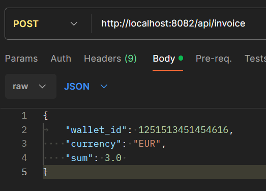
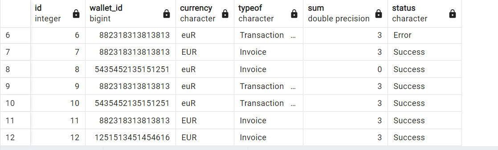

# Транзакционная система
## ПАТЧ НОУТ ВЕРСИИ 1.1:
1. Переработана структура БД. Добавлен индекс на поле wallet ID для ускорения поиска, теперь появился столбец валюты (на гет запросах будет видно, можно выводить либо все балансы валют, либо только конкретной)
2. Добавлено новое поле в таблицу транзакций с типом операции( перевод, внесение, cнятие)
3. Добавлена новая таблица с историей переводов (от кого, кому, валюта, сумма, Дата-время)
4. Декомпозирован уровень репозитория, большинство функций поделено на подфункции, для удобства работы с уровнем в целом
5. Переработаны dependency inversion, после декомпозиции репозитория, вынесена вся бизнес логика на уровень сервисов так, чтобы в репозиторий летели уже обработанные данные, которые просто надо добавить в БД (Мог конечно напутать но перерабатывал исходя из этой логики)
6. Подчищены sprintf в sql запросах (заменил на $) 
!!!Sprintf там где он сейчас есть используется для удобной подстановки имени таблицы, никакие данные от юзера через него не вставляются!!!
7. Добавлена новая ручка /transfer, для перевода средств между счетами: у юзера которому переводят валюту, которой у него нет, создается кошелек с этой валютой. Если юзер кидает валюту которой у него нет, бросается ошибка
8. Добавлена ручка получения баланса /balance/{wallet_id}, которая вернет json с массивом всех "подкошельков" с валютами и номиналом
9. К предыдущему пункту добавлен роут /balance/{wallet_id}/{currency}, который возвращает счет с конкретной валютой

## Запуск

Через golang на локальном постгрессе:

1. Заменить host в конфиге на "localhost"
2. В корневой папке `go run cmd/main.go`

Через докер:
1. Заменить host в конфиге на "db"
2. Прописать `docker-compose up  --build transaction-app`

## Ручки
### PUT

- `/invoice`
человеку зачисляются средства. Запрос с такими параметрами в теле, как код валюты ("USDT", "RUB", "EUR", etc.), количество средств (число с плавающей точкой), номер кошелька или карты.

- `/withdraw`
выводит средства со своего баланса по валюте, которую он выбрал с такими параметрами в теле, как код валюты, количество средств, номер кошелька или карты куда зачисляются средства.

- `/transfer`
- переводы между пользователями с параметрами в теле код валюты, кол-во, от кого, кому.

### GET
- `/balance/{wallet_id}`
- получение баланса по всем валютам

- `/balance/{wallet_id}/{currency}`
- получение баланса по конкретной валюте

## Проверка на ошибку

Возьмем больше средств чем есть на кошельке

