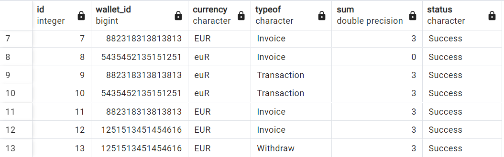
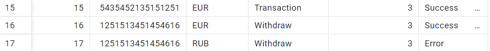

# Транзакционная система

## Запуск

Через golang на локальном постгрессе:

1. Заменить host в конфиге на "localhost"
2. В корневой папке `go run cmd/main.go`

Через докер:
1. Заменить host в конфиге на "db"
2. Прописать `docker-compose up  --build transaction-app`

## Ручки

- `/invoice`
человеку зачисляются средства. Запрос с такими параметрами в теле, как код валюты ("USDT", "RUB", "EUR", etc.), количество средств (число с плавающей точкой), номер кошелька или карты.

- `/withdraw`
выводит средства со своего баланса по валюте, которую он выбрал с такими параметрами в теле, как код валюты, количество средств, номер кошелька или карты куда зачисляются средства.

## Проверка на ошибку

Возьмем больше средств чем есть на кошельке

